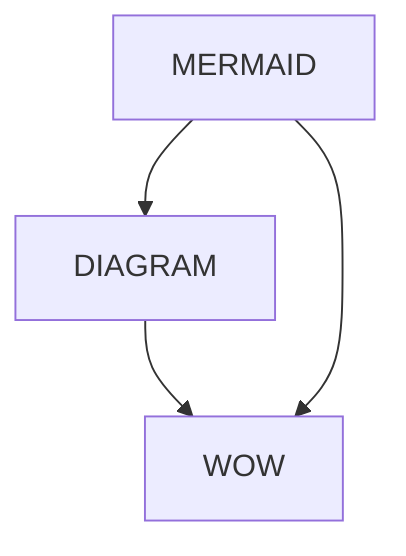

>[!TIP] This is a Tip

>[!WARNING] This is a Warning

>[!INFO] This is info



```
| left align | right align | center align  |
| :--        |         --: |     :--:      |
| test       |        test |     test      |

```

| Left-aligned text | Center-aligned text | Right-aligned text |
| :---------------- | :-----------------: | -----------------: |
| Content           |       Content       |            Content |
|                   |                     |                    |

```c++ 
int x = 5;
for (int i = 1; i<6;++i)
{
	//example code;
}
```

# Header 1
## Header 2
### Header 3
#### Header 4
##### Header 5
###### Header 6


**BOLD TEXT**
*ITALIC TEXT*